# Projeto Final - Desenvolvimento de Software Através de Frameworks @ IFMT/2023

## Restringindo o acesso a uma API utilizando o KeyCloak 

- **Biblioteca/Framework:** 

    [Spring Framework - Security with Oauth2 Resource Server](https://docs.spring.io/spring-security/reference/servlet/oauth2/resource-server/index.html)

- **Tecnologias aplicadas:** 
    - [Java 17](https://adoptium.net/temurin/archive/?version=17)
    - [spring-boot 3.1.5](https://spring.io/projects/spring-boot)
        - [Spring Web 6.0.13]()
        - [Spring Security 6.0.15](https://docs.spring.io/spring-security/reference/index.html)
             - [Spring OAuth2 Resource Server](https://docs.spring.io/spring-security/reference/servlet/oauth2/resource-server/index.html)
    - [Docker](https://docs.docker.com/)
    - [PostgreSQL](https://www.postgresql.org/docs/)
    - [KeyCloak](https://www.keycloak.org/documentation)

- Conceitos importantes:
    - [OAuth2](https://oauth.net/2/)
    - [OpenID Connect](https://openid.net/developers/how-connect-works/)

- **Integrantes:**
    - Alison Sacal Lima 
    - Bruno de Oliveira Figueiredo
    - Edinei Nissola
    - Eduardo Ormond dos Santos
    - Francisco Jose Prata Vidal
    - Jefferson Gonçalves de Oliveira Reis

  

## 1. Descrição da biblioteca/framework

O Spring Security é um módulo do Spring Framework com a finalidade de fornecer estruturas para autenticação, autorização e proteção contra determinados ataques. Dentro desse módulo existem várias possibilidades de implementações de Autenticação e Autorização, sendo que nesse projeto iremos abordar a utilização do protocolo OAuth2 trabalhando com o Resource Server.

## 2. Descrição do problema

Dado o acesso restrito a alguns recursos disponibilizados em um backend denominado (project-api) deveremos conseguir limitar o acesso determinados endpoint através da validação da autenticação e autorização. 

Cada endpoint deverá ter uma autorização específica para ser acessado.

- GET:/api/foo 
    - Acessível apenas para usuários com a role "ROLE_GET_FOO"
- POST:/api/foo
    - Acessível apenas para usuários com a role "ROLE_POST_FOO"
- PUT:/api/foo
    - Acessível apenas para usuários com a role "ROLE_PUT_FOO"

Para validar as restrições utilizaremos os três usuários com suas respectivas ROLES:

- admin
    - "ROLE_GET_FOO"
    - "ROLE_POST_FOO"
    - "ROLE_PUT_FOO"
- usuario
    - "ROLE_POST_FOO"
    - "ROLE_PUT_FOO"
- restrito
    - "ROLE_PUT_FOO"

## 3. Solução

### Levantando o KeyCloak com Docker

Para gerenciamento dos usuários, autenticação e autorização, iremos utilizar o [KeyCloak](https://www.keycloak.org/).

- **Parte 1 -** Criando os Dockerfiles

    Iremos rodar buildar uma imagem utilizando uma imagem diponível serviço de registro de containers da RedHat a [quay.io](quay.io), gerando uma imagem final apenas com o resultado do gerador.

    - ./keycloak/Dockerfifle

    Como iremos trabalhar com o banco externo PostgreSQL e imaginando a necessidade de outros projetos também utilizarem esse banco criamos um Dockerfile para o postgreSQL apenas para copiar um arquivo para inicialização de mais de um database no start.

    - ./postgres/Dockerfile
    - ./postgres/create-multiple-postgresql-databases.sh

 

- **Parte 2 -** Criando o docker-compose

    Utilizaremos o docker compose para levantarmos KeyCloak, PostgreSQL e o PGAdmin

    - ./docker-compose.yml

 

- **Parte 3 -** Levantamos o ambiente para configuração

    docker compose up -d

### Configurando o KeyCloak

- **Parte 1 -** Criando um REALM

    Por conceito o REALM é uma área isolada onde serão criadas as politicas de segurança, configuração dos clients que terão acesso a esse contexto bem como seus usuários e permissões. 

    O próprio KeyCloa utiliza o Realm Master para gerenciar a autenticação e autorização da ferramente, sendo assim por questões de isolamente e segurança de disponibilidade é altamente recomendado criar um novo REALM para iniciar a configuração do(s) Client(s) que irão utilizar o ambiente.

    - Para criarmos o Realm iremos apenas utilizar a botão:

     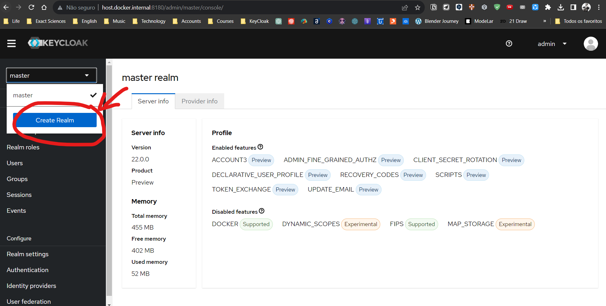

    - Na próxima tela definir um nome e clicar em create

    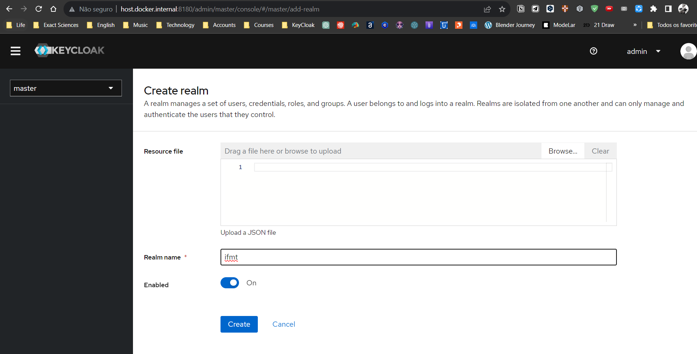

    - A partir deste momento todas nossas configurações serão relizadas dentro deste REALM

    - Documentação oficial para criação de REALMs [Clique aqui](https://www.keycloak.org/docs/latest/server_admin/index.html#configuring-realms)

 
 

- **Parte 2 -** Criando um client

    - O client é a representação de uma aplicação que irá utilizar no serviço de autenticação. Para criarmos nosso cliente, iremos acessar a sessão Clients->Create Client

    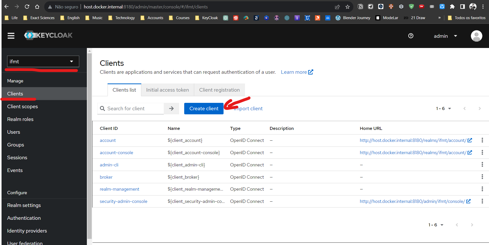

    - Defina um Client ID para o client e clique em Next

    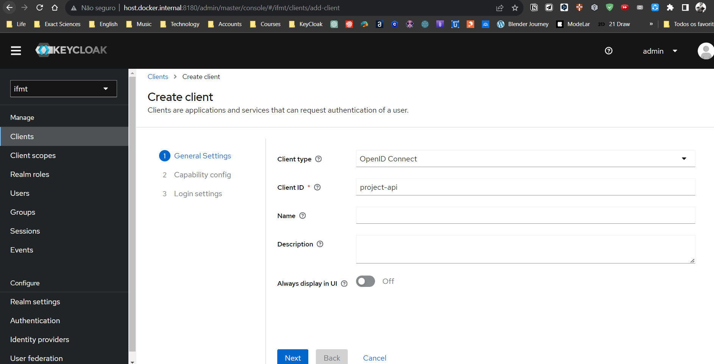

    - Na próxima tela manteremos a configuração padrão, então apenas clique em Next

    - E na última tela apenas iremos adicionar o wildcard * para as Valid URIs

    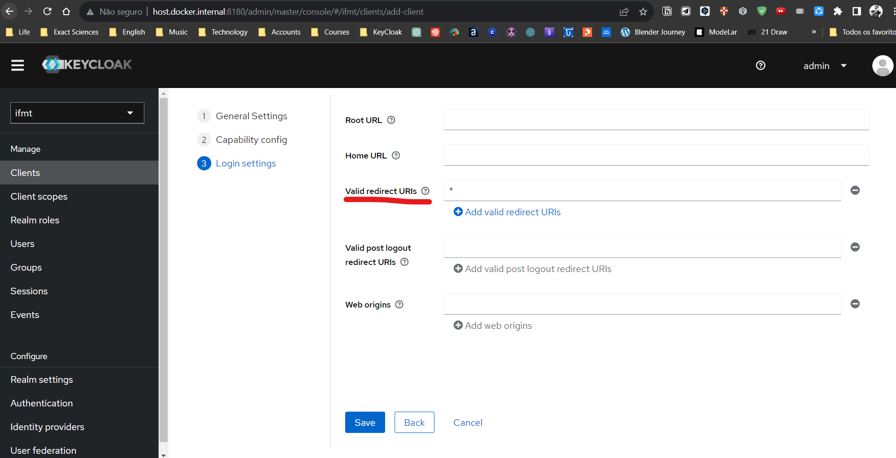

 
 

- **Parte 3 -** Criando as ROLES para o client

    - As Roles são representações de permissões que os usários podem ter. Aqui iremos utilizar as ROLES vinculadas ao próprio client mas poderíamos utilizar ROLES do próprio REALM.

    - Para criarmos a ROLES do client, dentro da configuração do próprio client iremos acessara aba ROLES e clicaremos em Create Role.

    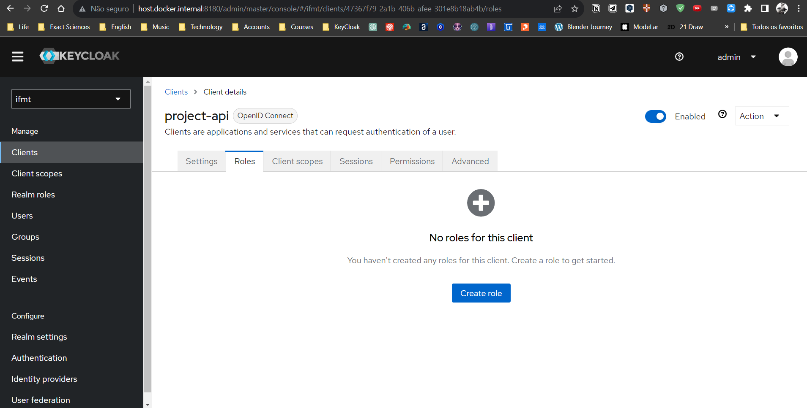

    - A criação da ROLE depende apenas do nome, iremos criar três para validarmos o nosso estudo de caso: GET_FOO, POST_FOO, PUT_FOO

    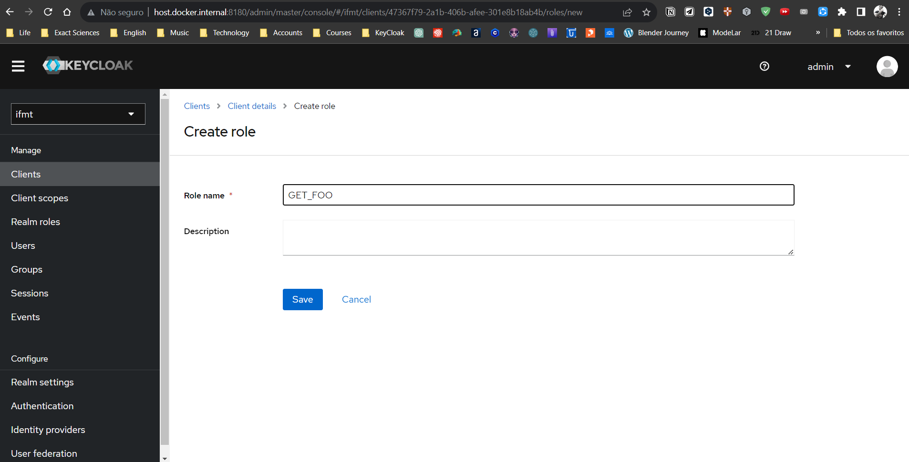

    - No final teremos as três ROLES criadas
    
    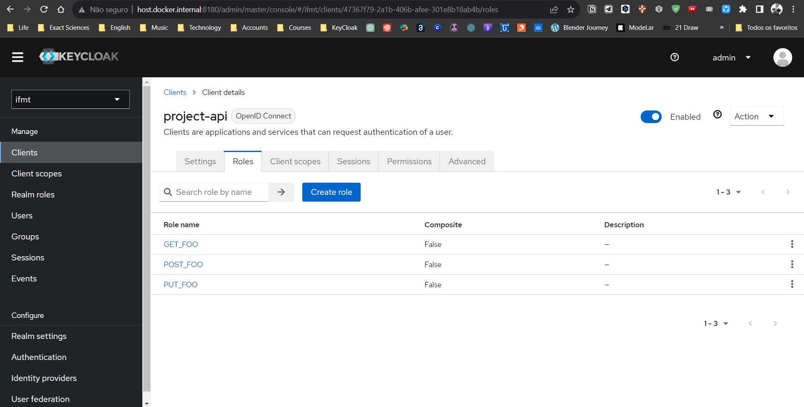

    - Documentação oficial para criação de Clients [Clique aqui](https://www.keycloak.org/docs/latest/server_admin/index.html#proc-creating-oidc-client_server_administration_guide)

 
 

- **Parte 4 -** Criando os usuários e atribuindo as Roles

    - Os Users são os usuários que terão acesso e permissões validadas pela KeyCloak. Iremos criar os três usuários definidos no nosso estudo de caso.

    - Para criar um User apenas acesse Users->Add User

    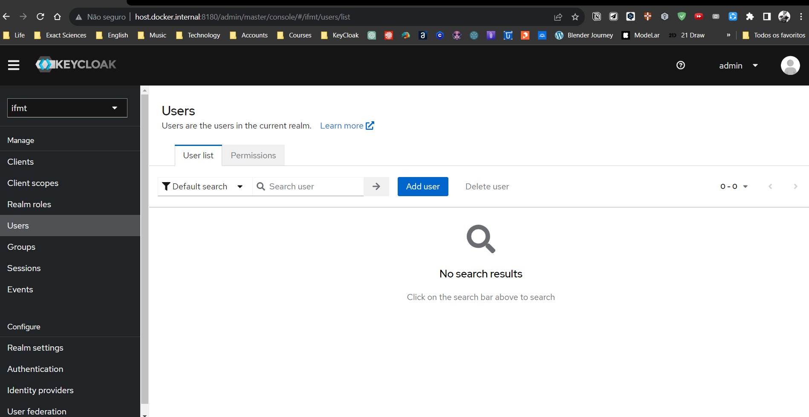

    - Criaremos o usuário admin, apenas definindo seu Username e clicando em create

    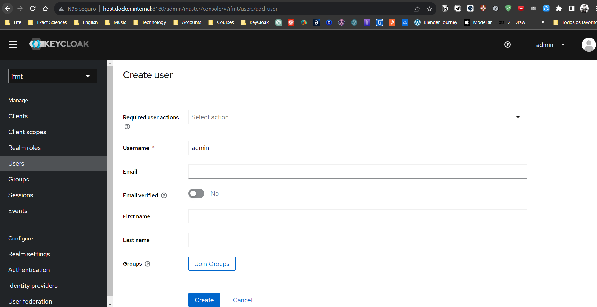

    - Para definirmos a senha do usuário utilizaremos a aba Crendentials dentro das configurações do usuário e clicando em Set password

    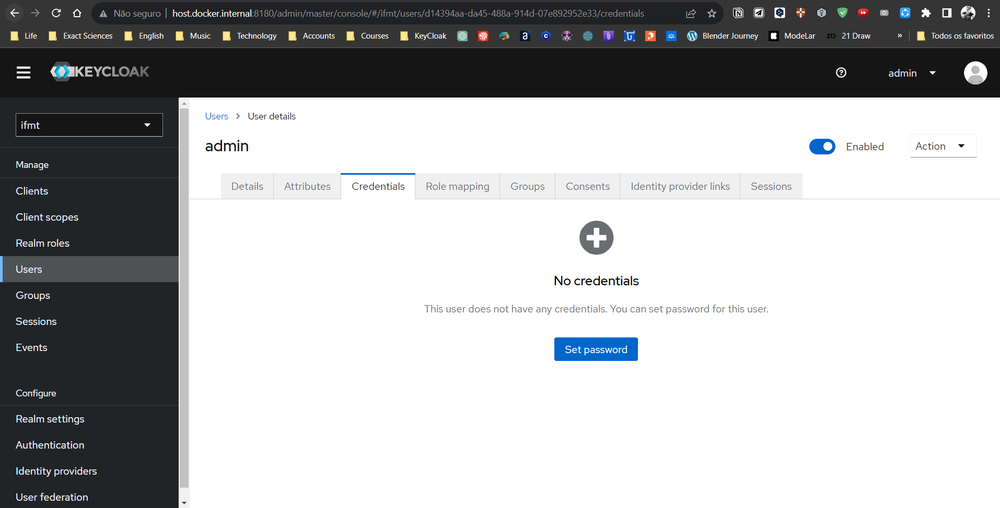

    - Definiremos a senha com o mesmo valor do username e desmarcamos a opção Temporary

    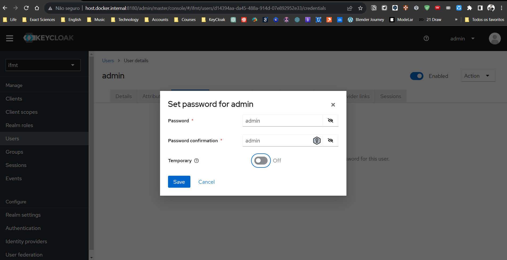

    - O nosso próximo passo agora é atribuir as devidas permissões ao usuário. Neste nosso caso do admin ele irá receber as três roles criadas.

    - Para isso acessamos a aba Role mapping e clicaremos em Assign role.

    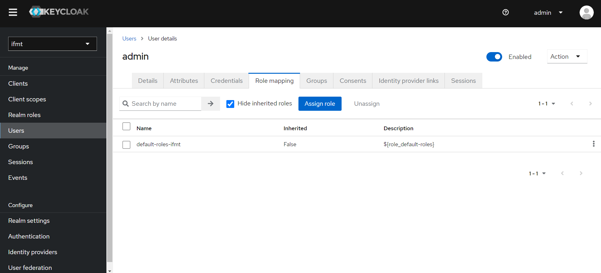

    - Mudando o filtro para clients "Filter by clients" conseguiremos navegar dentre as roles disponíveis ou informar o nome do client que desejamos listar a role como feito na imagem abaixo e por fim selecionaremos as três roles conforme previsto no estudo de caso para o usuário admin.

    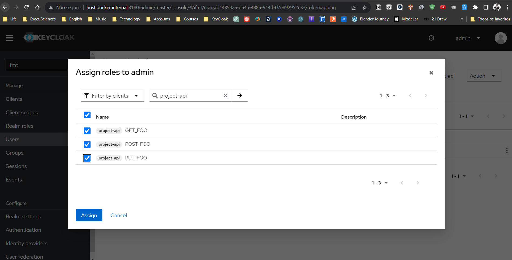

    - Agora só repetirmos o processo para os outros dois usuários, atribuindo-lhes as devidas permissões(roles).

    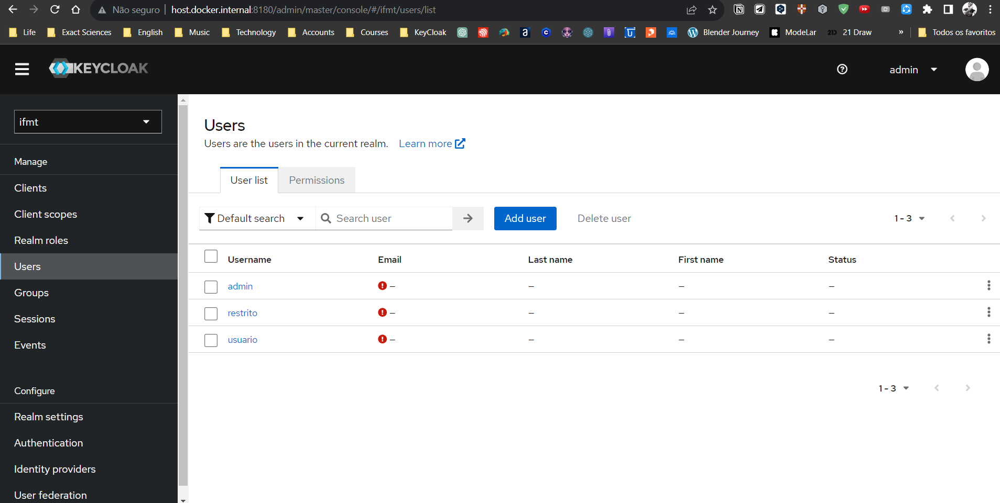

    
    - Documentação oficial para criação de USUÁRIOS [Clique aqui](https://www.keycloak.org/docs/latest/server_admin/index.html#assembly-managing-users_server_administration_guide)

    - Documentação oficial para atribuição de permissões com ROLES [Clique aqui](https://www.keycloak.org/docs/latest/server_admin/index.html#assigning-permissions-using-roles-and-groups)

 
 

### Criando a Aplicação

- **Parte 1 -** Gerando a aplicação através do Starter do Spring Tools Suite

- Utilizar o Starter do STS apenas iremos marcar as dependencias:

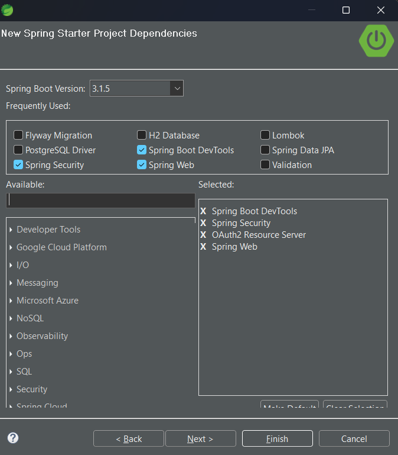

- A principal configuração para funcionando do OAuth2 é informar o endereço onde ele irá obter as inforamações para validação do token.

- Essa configuração é realizada o application.yml

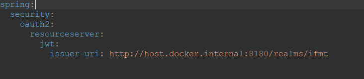

- Iremos habilitar o Spring Security com a anotação @EnableWebSecurity e @EnableMethodSecurity para controle das permissões com roles atavés dos métodos.

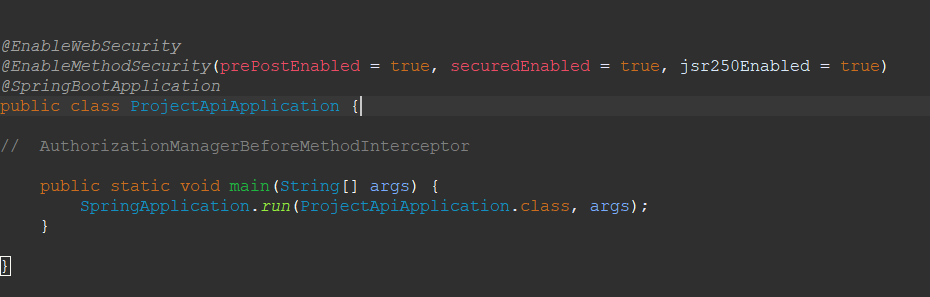

  

- Agora iremos configurar o nosso securityFilterChain, setando o OAuth2 Resource Server e Criando um converter do JWT que consiga recuperar os Grants do Access Token enviado no Header.

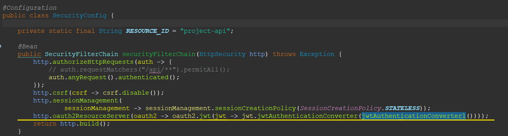

- Para o converter do JWT temos duas implementações, sendo a primeira necessário a crição de um SCOPE_CLIENT para o CLIENT project-api que exporte as ROLES do client em um Claim denomiado roles e a segunda uma implementação que extrai com base nas configurações padrões apenas para exemplo.

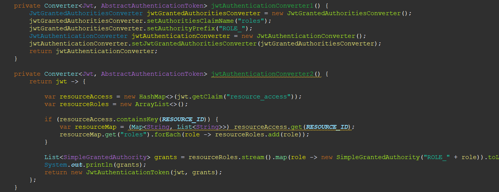

- Por fim o nosso Controller que possui seus métodos anotados conforme a definição do nosso estudo de caso

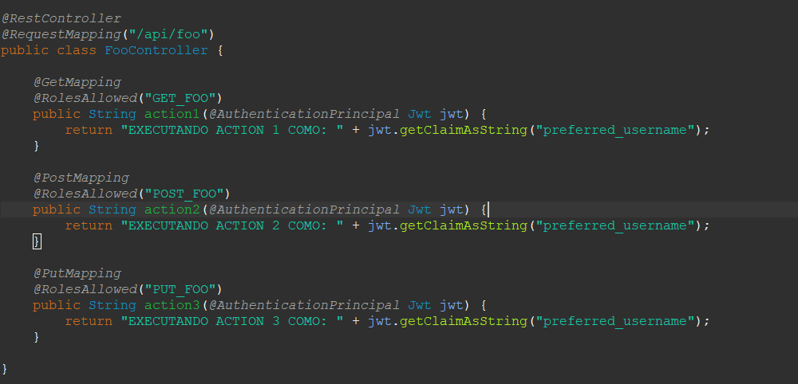

  

### Postman

- Para validarmos nosso estudo de caso podermos utilizar o postman.

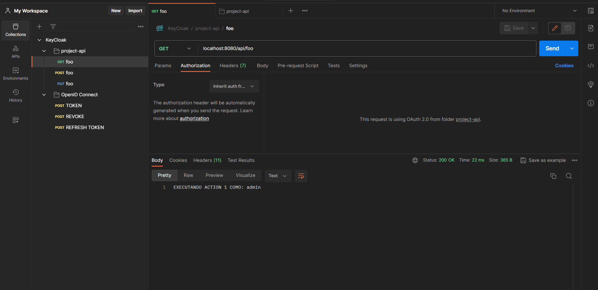

- Está disponível para importação collection utilizada para realizar as chamadas ao endpoint

    - ./postman/KeyCloak.postman_collection.json

  

## 4. Referências

- [Get started with Keycloak on Docker](https://www.keycloak.org/getting-started/getting-started-docker)
- [Running Keycloak on Docker](https://medium.com/@nishada/running-keycloak-on-docker-6f23e59b2023)
- [Run Keycloak in docker with extenal DB*](https://medium.com/@ozbillwang/run-keycloak-in-docker-with-extenal-db-1b504ad00eae)
- [Learn how to run Keycloak from a container image](https://www.keycloak.org/server/containers)
- [Learn how to make Keycloak ready for production](https://www.keycloak.org/server/configuration-production)
- [Run Keycloak locally with Docker compose*](https://medium.com/@ozbillwang/run-keycloak-locally-with-docker-compose-db9a9f2fb437)
- [How to configure the Keycloak server to store data in a relational database](https://www.keycloak.org/server/db)
- [Managing Resource Servers](https://www.keycloak.org/docs/latest/authorization_services/index.html#_resource_server_overview)
- [KeyCloak Spring Boot A dapter - Deprecated*](https://www.keycloak.org/docs/22.0.5/securing_apps/#_spring_boot_adapter)
- [Spring Boot REST Service Protected Using Keycloak Authorization Services*
](https://github.com/keycloak/keycloak-quickstarts/tree/latest/spring/rest-authz-resource-server)
- [Using OpenID Connect to secure applications and services](https://www.keycloak.org/docs/22.0.5/securing_apps/#_oidc)
- [Spring Security - Map Authorities from JWT*](https://www.baeldung.com/spring-security-map-authorities-jwt)
- [Using multiple databases with the official PostgreSQL Docker image](https://github.com/mrts/docker-postgresql-multiple-databases/tree/master)
- [Spring Boot 3 - Keycloak integration for beginners*](https://www.youtube.com/watch?v=vmEWywGzWbA)

\* Recomendado